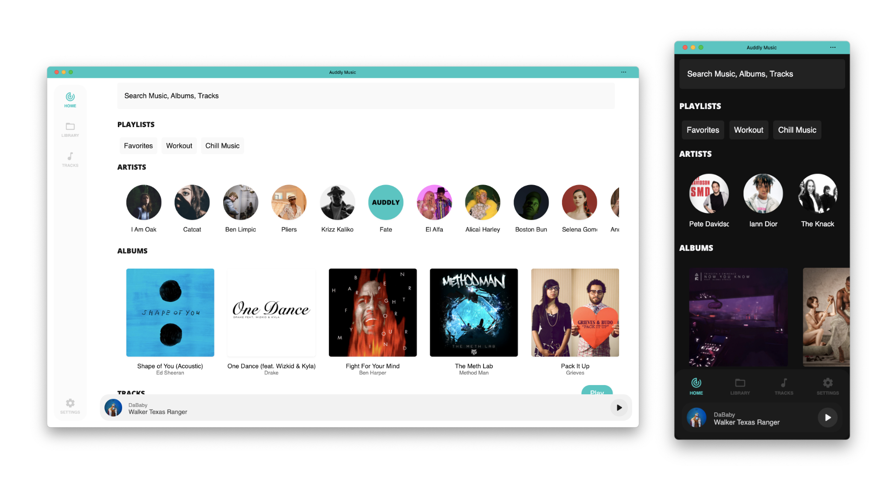

<div align="center">


# 🎵 Auddly

### Servidor de streaming musical self-hosted 🚀

<p align="center">
  <b>Auddly</b> es una plataforma moderna de streaming musical auto hospedada, diseñada para ofrecer una experiencia rápida, minimalista y multiplataforma mediante una aplicación PWA instalable.
</p>

<p align="center">
  
  
  
  
</p>

<p align="center">
  <a href="#-preview">Preview</a> •
  <a href="#-características">Características</a> •
  <a href="#-tecnologías-utilizadas">Tecnologías</a> •
  <a href="#-instalación">Instalación</a> •
  <a href="#-roadmap">Roadmap</a>
</p>

</div>

---

# 🌊 Acerca de Auddly

**Auddly** es una aplicación web progresiva (PWA) enfocada en streaming musical self-hosted.

El proyecto funciona como frontend para:

```bash
Wellenline/auddly-server
```

permitiendo administrar y reproducir música desde tu propio servidor.

Gracias a su arquitectura moderna, puede instalarse como aplicación en:

- 💻 Desktop
- 📱 Android
- 🍎 iOS
- 🌐 Navegadores modernos

---

# 📸 Preview

<div align="center">



</div>

---

# ✨ Características

## 🎧 Streaming Musical

- 🎵 Reproducción de música online
- 📂 Biblioteca musical personal
- ⚡ Streaming rápido
- 🌐 Conexión con servidor self-hosted
- 🎶 Experiencia multimedia minimalista

---

## 📱 Progressive Web App

- 📲 Instalación como app
- ⚡ Soporte offline parcial
- 🌙 UI adaptable
- 🚀 Carga rápida
- 💻 Compatible con múltiples plataformas

---

## 🐳 Docker Ready

- ⚡ Despliegue rápido
- 🐳 Contenedor Docker listo
- 🔥 Fácil configuración
- ☁️ Ideal para servidores VPS o NAS

---

# 🛠️ Tecnologías Utilizadas

## 🎨 Frontend

<p>
  
</p>

- Angular
- TypeScript
- HTML5
- CSS3
- PWA Support

---

## ☁️ Backend & Deploy

<p>
  
</p>

- Docker
- Nginx
- Self Hosted Server
- REST API

---

## 🧰 Herramientas

<p>
  
</p>

- Git & GitHub
- VS Code
- Angular CLI

---

# 📂 Estructura del Proyecto

```bash
auddly/
│
├── src/             # Código fuente Angular
├── assets/          # Recursos estáticos
├── dist/            # Build producción
├── docker/          # Configuración Docker
└── README.md
```

---

# ⚡ Instalación

## 1️⃣ Clonar el repositorio

```bash
git clone https://github.com/Wellenline/auddly.git
```

---

## 2️⃣ Entrar al proyecto

```bash
cd auddly
```

---

# 🐳 Ejecutar con Docker

## 🚀 Iniciar contenedor

```bash
docker run --rm -d -p 80:80/tcp wellenline/auddly:latest
```

La aplicación quedará disponible en:

```bash
http://localhost
```

---

# 💻 Desarrollo Local

## ▶️ Servidor de desarrollo

```bash
ng serve
```

Abrir en:

```bash
http://localhost:4200/
```

La aplicación se recargará automáticamente al detectar cambios.

---

# 📦 Build Producción

## 🔥 Compilar aplicación

```bash
ng build
```

Los archivos generados estarán en:

```bash
dist/
```

---

## 🚀 Build optimizado

```bash
ng build --prod
```

---

# 🌐 Versión Online

También puedes utilizar la versión hospedada oficialmente:

```bash
https://music.auddly.app
```

---

# 📊 Roadmap

## 🚧 Próximamente

- 🎶 Playlists personalizadas
- ❤️ Favoritos
- 🌙 Dark Mode avanzado
- 📱 Mejor soporte móvil
- 🔍 Búsqueda inteligente
- ☁️ Sincronización entre dispositivos
- 🎵 Mejoras de rendimiento

---

# 🤝 Contribuciones

Las contribuciones son bienvenidas ❤️

## Pasos para contribuir

1. Haz Fork del proyecto
2. Crea una rama

```bash
git checkout -b feature/nueva-funcion
```

3. Realiza cambios
4. Haz commit

```bash
git commit -m "✨ Nueva funcionalidad"
```

5. Haz push

```bash
git push origin feature/nueva-funcion
```

6. Abre un Pull Request 🚀

---

# 👨‍💻 Créditos

## Proyecto relacionado

- Wellenline/auddly-server
- Angular PWA
- Docker Ecosystem

---

# 🌟 Apoya el Proyecto

Si te gusta Auddly:

⭐ Dale una estrella al repositorio  
🍴 Haz Fork del proyecto  
📢 Compártelo con otros desarrolladores

---

# 📜 Licencia

Este proyecto es open source y está disponible bajo licencia libre.

---

<div align="center">

### 🎶 Auddly — Tu música, tu servidor, tu experiencia.

</div>
